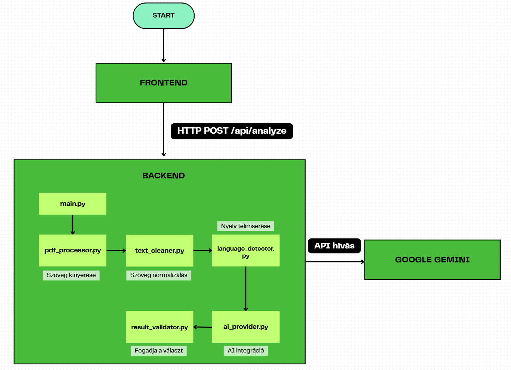

# Fejlesztői Specifikáció - PDF Tápérték & Allergén Kinyerő

**Stack:** Python 3.13 + FastAPI + Google Gemini AI | React 18 + Vite

---

## Rendszer áttekintés

### Cél:
Automatizált tápérték és allergén információk kinyerése strukturálatlan PDF dokumentumokból AI segítségével.

### Főbb funkciók
- **Többlépcsős PDF kinyerés:** pdfplumber → PyMuPDF → Tesseract OCR kaszkád
- **Nyelv detektálás:** Automatikus dokumentum nyelv felismerés (magyar, angol, német, francia)
- **AI-alapú kinyerés:** Google Gemini 2.0 Flash intelligens adatkinyeréshez
- **Strukturált kimenet:** Validált JSON tápérték adatokkal (6 mező) és allergénekkel (10 típus)
- **Valós idejű feldolgozás:** Aszinkron FastAPI backend <10mp feldolgozási idővel

### Cél adatok, melyeket keresünk:

**Tápértékek (100g-ra):**
- energia (energy) - kcal
- zsír (fat) - g
- szénhidrát (carbohydrate) - g
- cukor (sugar) - g
- fehérje (protein) - g
- nátrium (sodium) - g 
- **Amennyiben a PDF-ben szerepel a só, úgy kiszámolja a nátrium tartalmát**

**Allergének (igen/nem):**
glutén, tojás, rák, hal, földimogyoró, szója, tej, diófélék, zeller, mustár

---

##  Architektúra

### Rendszer komponensek



**Technológiai stack**

**Backend:**
- **Futtatókörnyezet:** Python 
- **Framework:** FastAPI
- **Szerver:** Uvicorn 0.30.6
- **PDF feldolgozás:** pdfplumber, PyMuPDF, pdf2image 
- **OCR:** pytesseract, Pillow 
- **AI:** google-generativeai 0.8.3
- **Nyelv detektálás:** langdetect 
- **Környezet:** python-dotenv 

**Frontend:**
- **Framework:** React 18
- **Build eszköz:** Vite
- **HTTP kliens:** axios
- **Fájl feltöltés:** react-dropzone

---

## Backend specifikáció

### Könyvtár struktúra

```
Backend/
─ main.py                      # FastAPI app
─ ai_provider.py               # Gemini AI integráció
─ prompt.txt                   # AI utasítás sablon
─ pdf_processor.py             # PDF szöveg kinyerés (3-lépcsős)
─ text_cleaner.py              # Szöveg normalizálás
─ language_detector.py         # Nyelv felismerés
─ result_validator.py          # JSON validálás
─ config.py                    # Konfiguráció kezelés
─ .env.example                 # Környezet sablon
─ requirements.txt             # Python függőségek
─ venv/                        # Virtuális környezet
```

### Fő modulok

#### 1. **main.py** - Kérés orchestráció

**Végpontok:**

```python
GET  /              # Állapot ellenőrzés
GET  /api/config    # Konfiguráció lekérése
GET  /api/provider # AI provider listázása
POST /api/analyze   # Fő PDF elemző végpont
```

**POST /api/analyze folyamat**

```python
async def analyze_pdf(file: UploadFile):
    # 1.: PDF tartalom kinyerése (pdf_processor.py)
    document = await pdf_processor.extract_document(pdf_bytes)
    # Bemenet: maga a PDF file
    # Kimenet: nyers szöveg
    
    # 2.: Szöveg tisztítás (text_cleaner.py)
    cleaned_text = TextCleaner.clean_text(document.text)
    # Bemenet: nyers szöveg a pdf_processor-ból
    # Kimenet: tisztított szöveg
    
    # 3.: Nyelv felismerés (language_detector.py)
    detected_language = LanguageDetector.detect(cleaned_text)
    # Bemenet: tisztított szöveg
    # Kimenet: "hu", "en", "de", "fr", vagy "unknown"
    
    # 4.: Metaadatok építése
    metadata = {
        "language": detected_language,
        "ocr_used": document.ocr_used,
        "char_count": len(cleaned_text)
    }
    
    # 5.: AI elemzés (ai_provider.py)
    ai_provider = get_ai_provider()
    extraction_result = await ai_provider.analyze_pdf(
        text=cleaned_text,
        language=detected_language,
        metadata=metadata
    )
    # Bemenet: tisztított szöveg + nyelv
    # Kimenet: JSON tápértékekkel és allergénekkel
    
    # 6.: Eredmények validálása (result_validator.py)
    validated_result = ResultValidator.validate_and_normalize(extraction_result)
    # Bemenet: AI JSON válasz
    # Kimenet: validált és normalizált JSON
```

Ez egy pipeline, ahol minden modul a kimenetét átadja a következőnek.

**Hibakezelés:**
- 400: Érvénytelen fájl típus 
- 500: Feldolgozási hibák (részletes üzenettel)

---

#### 2. pdf_processor.py - PDF szöveg kinyerés

**4-lépcsős PDF feldolgozási kaszkád:**

**1. lépcső: pdfplumber**
- Leggyorsabb módszer digitális PDF-ekhez
- pdfplumber.open() - belső szöveges objektumok kinyerése
- Visszaad szöveget ha >100 karakter

**2. lépcső: PyMuPDF**
- Jobb elrendezés kezelés komplex PDF-eknél
- fitz.open() - intelligens szöveg sorba rendezés
- Fallback ha pdfplumber <100 karakter

**3. lépcső: Tesseract OCR**
- Szkennelt dokumentumokhoz (képből szöveg)
- **Egyszerű képelőkészítés PIL-lel:** Szürkeskála konverzió
- **OCR végrehajtás:** pytesseract.image_to_string()
- **Többnyelvű támogatás:** magyar + angol + német + francia (hun+eng+deu+fra)
- **DPI:** 300 DPI renderelés a Poppler segítségével

**4. lépcső: Gemini Vision API (hibrid intelligens fallback)**
- **Aktiválás feltételei (bármelyik teljesül):**
  1. Üres nutrition adatok
  2. Minden tápérték `null`
  3. **Hiányzó só/nátrium** (kritikus adat, gyakori OCR hiba)
  4. **OCR artifaktok észlelése:** `"LL"` (1.1 helyett), `"Sig"` (5g helyett), `"II"` (11 helyett)
  
- **Működés:** A PDF képét közvetlenül a Gemini multimodális modellnek küldi
- **Előny:** Az LLM **vizuálisan** értelmezi a táblázatokat (nem OCR, hanem AI-alapú képfelismerés)
- **Implementáció:**
  ```python
  # Minőség ellenőrzés
  def is_poor_quality_result(result, ocr_used):
      # 1. Üres?
      if not result.get("nutrition"): return True
      # 2. Minden null?
      if all(v.get("per_100g") is None for v in result["nutrition"].values()): return True
      # 3. Hiányzik só/nátrium?
      if result["nutrition"].get("nátrium", {}).get("per_100g") is None: return True
      # 4. OCR artifaktok? (LL, Sig, II)
      if ocr_used and any(suspect in str(v) for suspect in ["LL", "Sig", "II"]): return True
      return False
  
  # Vision fallback
  if is_poor_quality_result(extraction_result, ocr_used):
      extraction_result = await gemini_vision_api(images)
  ```
- **Limitáció:** Maximum 3 oldal (API költség optimalizálás)


#### 3. text_cleaner.py - Szöveg normalizálás

```python
def clean_text(text: str) -> str:
    """
    Teljes tisztítási folyamat:
    1. Numerikus vesszők javítása (18,9 → 18.9)
    2. Szóközök normalizálása
    3. Zaj eltávolítása (túl sok sortörés, speciális karakterek)
    """
    text = TextCleaner._fix_numeric_commas(text)
    text = TextCleaner._normalize_whitespace(text)
    text = TextCleaner._remove_noise(text)
    return text
```

---

#### 4. language_detector.py - Nyelv felismerés

```python
def detect(text: str) -> str:
    """
    Nyelv felismerés langdetect használatával.
    Visszaad: 'hu', 'en', 'de', 'fr', 'unknown'
    """
    detect_langs(text)  
```
---

#### 5. ai_provider.py - Gemini AI integráció

**Fő metódusok:**

**_extract_nutrition_section(text: str) -> str**
- **Cél:** Optimalizálás, csak a tápérték táblázatot küldi Gemini-nek (nem teljes 6000+ karakter)
- **Stratégia:** Markerek keresése: "Nutritional information", "Tápérték adatok", "Energy/Energia"
- **Visszaad:** ~400 karakteres szakasz a tápérték táblázat körül, vagy üres string

**analyze_pdf(text, language, metadata) -> Dict**
- **Fő feldolgozó metódus**
- **Lépések:**
  1. Prompt lekérése **_get_prompt()**-tal
  2. Tápérték szakasz kinyerése **_extract_nutrition_section()**-nal
  3. Végleges prompt építése:
     - Ha szakasz megtalálva: TELJES szöveg (allergének) + SZAKASZ (tápérték)
     - Ha nincs szakasz: csak teljes szöveg
  4. Gemini API hívás (async): **model.generate_content_async()**
  5. JSON válasz feldolgozása **_parse_json_response()**-zal

**Prompt stratégia (prompt.txt-ből):**
- Felsorolja a pontos magyar kulcsokat tápértékekhez és allergénekhez
- Konkrét BEMENET/KIMENET példát ad (ez fontos)
- Szabályokat specifikál: vessző→pont konverzió, só→nátrium számítás
- Kéri hogy CSAK JSON kimenetet adjon (nincs markdown)

**_parse_json_response(response_text: str) -> Dict**
- Leveszi a markdown fence-eket (` ```json `)
- Feldolgozza a JSON-t
- Fallback: regex kinyerés ha feldolgozás sikertelen
- ValueError-t dob ha JSON nem nyerhető ki

---

#### 6. result_validator.py - JSON validálás


**Validálja a JSON struktúrát és normalizálja az értékeket.**
- Biztosítja hogy léteznek a nutrition és allergens kulcsok
- Validálja a tápérték formátumot: {"per_100g": "érték", "unit": "mértékegység"}
- String boolean-okat átalakít valódi boolean-okká
- Normalizálja a null értékeket

---

**Alkalmazott optimalizálások:**
- Tápérték szakasz kinyerés (csökkenti Gemini bemenetet 6000→400 karakterre)
- Async/await nem-blokkoló I/O-hoz
- 3-lépcsős PDF kinyerési kaszkád (gyors módszerek előbb)

---

## Frontend specifikáció

### Könyvtár struktúra

```
Frontend/
─ src/
   ─ App.jsx               # Fő komponens
   ─ index.css             # Stílusok
   ─ main.jsx              # Belépési pont
─ index.html               # HTML 
─ vite.config.js           # Vite konfiguráció
─ package.json             # Függőségek
```

### Fő komponens: App.jsx

**Főbb funkciók:**

**1. Fájl feltöltés (react-dropzone):**

A **react-dropzone** könyvtárat használjuk drag & drop funkcióhoz:
- **Elfogadott formátum:** Csak PDF fájlok (`.pdf`)
- **Fájl limit:** Maximum 1 fájl egyszerre
- **Méret limit:** 10 MB maximális fájlméret
- **Drag & drop:** A felhasználó ráhúzhatja a fájlt a feltöltési területre
- **Kattintás:** Kattintással is kiválasztható fájl


**2. PDF elemzés:**

Az elemzés gomb megnyomásakor a következő történik:
- **FormData létrehozása:** A kiválasztott PDF fájlt FormData objektumba csomagolja
- **Backend hívás:** POST kérés a **/api/analyze** végpontra
- **Content-Type:** **multipart/form-data** fejléc (fájl feltöltéshez)
- **Timeout:** 60 másodperc maximális várakozási idő
- **Válasz kezelése:** A kapott JSON eredményt elmenti és megjeleníti

**3. Eredmények megjelenítés:**
- **Tápérték táblázat:** 6 érték kártya formátumban
- **Allergén lista:** Tartalmazza/Nem tartalmazza
- **Metaadatok:** Nyelv, OCR használat


**UI állapotok:**
1. Feltöltés: Dropzone + fájl info
2. Töltés: Spinner + folyamat üzenet
3. Hiba: Hiba üzenet + újra gomb
4. Eredmény: Két oszlopos rács (allergének | tápértékek)

---

### Stílusok (index.css)

**Design rendszer:**
- **Színséma:** Sötét téma 
  - Háttér: `#0a0a0a`
  - Kártyák: `#1a1a1a`
  - Elsődleges: `#76b900` (zöld)
  - Szöveg: `#ffffff`, `#a0a0a0`

**Tipográfia:**
- Betűtípus: `Space Grotesk` (Google Fonts)

**Reszponzív:**
- Egy oszlopos elrendezés mobilon
- Teljes szélességű gombok

---

## Adatfolyam

### Végpontok közti kérés folyamat


---

### PDF feldolgozási függőségek

A rendszer **4-lépcsős PDF feldolgozást** használ:

**pdfplumber 0.11.4** (elsődleges módszer - 1. lépcső)
- Gyors szöveg kinyerés digitális PDF-ekből
- A PDF belső struktúráját olvassa (text objects), nem renderel képet
- Komplex layout-nál (többoszlopos, táblázatok) összekeverheti a sorrendet

**PyMuPDF / fitz** (2. lépcső fallback)
- Jobb layout megőrzés, komplex PDF-ek kezelése
- Renderel belső vektoros adatokból, intelligens szöveg sorba rendezés
- Belép, ha: pdfplumber <100 karakter szöveget ad vissza
- Jobban kezeli a többoszlopos elrendezést, táblázatokat

**Tesseract OCR + Poppler + PIL** (3. lépcső - szkennelt PDF-ek)
- Szkennelt dokumentumok olvasása képről (OCR = Optical Character Recognition)
- **Működése:** 
  1. **Poppler (pdf2image 1.17.0):** PDF → PNG képek konvertálása 300 DPI-vel (oldalanként)
  2. **PIL képelőkészítés:** Egyszerű szürkeskála konverzió
  3. **Tesseract 5.5.0:** Kép → szöveg felismerés neurális hálózattal
  4. Többnyelvű modell: **hun+eng+deu+fra** (magyar, angol, német, francia)
- Belép, ha: PyMuPDF is <100 karakter szöveget ad
- Egyetlen módszer ami szkennelt PDF-eket tud kezelni

**Gemini Vision API** (4. lépcső - végső mentőöv)
- **Amikor aktiválódik:** Ha az 1-3. lépcső üres vagy használhatatlan adatot ad (minden tápérték `null`)
- **Működés:** PDF képét közvetlenül LLM-nek küldi vizuális elemzésre (nem OCR!)
- **Előny:** AI-alapú képfelismerés, táblázatok vizuális értelmezése
- **Hátrány:** 15-20x drágább mint szöveges API, 2-3x lassabb


Ha digitális PDF, akkor csak az 1-es vagy 2-es lépcső fut le!  
Ha szkennelt PDF, akkor 1→2→3 (OCR).  
Ha minden kudarcot vall: 4. Vision API.

---

## Szótár (Glossary)

### Technológiai fogalmak

**API (Application Programming Interface)**
- Alkalmazás programozási felület, amely lehetővé teszi különböző szoftverek közötti kommunikációt
- A projektben: REST API végpontok a frontend-backend kommunikációhoz

**Aszinkron (Async/Await)**
- Nem-blokkoló programozási minta, ahol a kód várakozás közben más feladatokat is végezhet
- A projektben: `async/await` használata FastAPI-ban és AI hívásokban

**Backend**
- A szerver oldali logika, amely a kéréseket feldolgozza és adatbázisokkal kommunikál
- A projektben: Python + FastAPI szerver

**CORS (Cross-Origin Resource Sharing)**
- Biztonsági mechanizmus, amely szabályozza, hogy mely weboldalak érhetik el az API-t
- A projektben: Frontend (localhost:5173) → Backend (localhost:8000) kommunikáció engedélyezése

**Endpoint (végpont)**
- Egyedi URL cím az API-n, amely egy adott funkciót lát el
- Példa: **POST /api/analyze** - PDF elemzés indítása

**FastAPI**
- Modern Python web framework API-k építéséhez, automatikus dokumentációval és típusellenőrzéssel
- Előnyök: gyors, async támogatás

**Frontend**
- A felhasználói felület, amit a böngészőben látsz és használsz
- A projektben: React + Vite alapú webalkalmazás

**JSON (JavaScript Object Notation)**
- Könnyen olvasható adatformátum kulcs-érték párokkal
- Példa: `{"energia": {"per_100g": "282", "unit": "kcal"}}`

**OCR (Optical Character Recognition)**
- Optikai karakterfelismerés - képről szöveggé alakítás technológia
- A projektben: Tesseract OCR szkennelt PDF-ek feldolgozásához

**PIL (Python Imaging Library / Pillow)**
- Python képfeldolgozó könyvtár alapvető műveletekhez
- A projektben: Szürkeskála konverzió OCR előtt

**Pipeline (feldolgozási lánc)**
- Modulok sorozata, ahol minden modul kimenetét a következő bemenetként használja
- A projektben: PDF → szöveg → tisztítás → nyelv → AI → validálás

**REST API**
- Architektúrális stílus webes szolgáltatásokhoz (GET, POST, PUT, DELETE műveletek)
- A projektben: FastAPI REST végpontok

**Vite**
- Modern frontend build eszköz, gyors fejlesztői szerverrel
- Előnyök: villámgyors hot reload, optimalizált produkciós build

### AI és gépi tanulás

**Gemini (Google Gemini AI)**
- Google multimodális AI modellje, amely szöveget, képet és más adatokat tud feldolgozni
- A projektben: Gemini 2.0 Flash - gyors szövegfeldolgozáshoz és adatkinyeréshez

**Gemini Vision API**
- Gemini multimodális képessége képek vizuális elemzésére
- Nem OCR! Az LLM közvetlenül "látja" és értelmezi a képet
- A projektben: 4. lépcsős fallback ha szöveges módszerek kudarcot vallanak
- Előny: Táblázatok vizuális értelmezése, kontextus megértés
- Hátrány: Drágább (~15-20x) és lassabb mint text API

**LLM (Large Language Model)**
- Nagy nyelvi modell - hatalmas szövegadatbázokon tanított AI
- Példák: Gemini, GPT, Claude

**Multimodális AI**
- Olyan AI modell, amely többféle adattípust is kezel (szöveg, kép, hang, videó)
- A projektben: Gemini képes szöveg + kép egyidejű feldolgozására

**Prompt (utasítás)**
- Az AI-nak adott szöveges instrukció, amely meghatározza a feladat elvégzését
- A projektben: **prompt.txt** fájl tartalmazza az adatkinyerési utasításokat


### PDF feldolgozás

**Digitális PDF**
- Olyan PDF, amely belső szöveges adatokat tartalmaz (pl. Word→PDF export)
- Gyorsan feldolgozható pdfplumber vagy PyMuPDF-fel

**Szkennelt PDF**
- Papír dokumentum beszkennelve PDF formátumba - csak képet tartalmaz, szöveget nem
- OCR szükséges a szöveg kinyeréséhez

**PDF rendering**
- A PDF vizuális megjelenítése képként
- A projektben: Poppler végzi ezt OCR előtt

**Text extraction (szövegkinyerés)**
- Szöveges adatok kiolvasása PDF-ből különböző módszerekkel
- 3 szint: pdfplumber → PyMuPDF → Tesseract OCR

**Image preprocessing (képfeldolgozás)**
- Kép minőség javítása OCR előtt egyszerű technikákkal
- A projektben: PIL szürkeskála konverzió

### Tápértékek és allergének

**Nátrium számítás**
- Képlet: **nátrium (g) = só (g) / 2.5**
- Magyarázat: konyhasó (NaCl) ~40% nátrium, ~60% klór

**Per 100g**
- Tápértékek standard mértékegysége - 100 gramm termékre vonatkoztatva
- Könnyebbé teszi a termékek összehasonlítását

**Allergének**
- Élelmiszer-összetevők, amelyek allergiás reakciót válthatnak ki
- EU törvény: 14 fő allergén kötelező feltüntetése (a projektben 10-et kezelünk)

### Fejlesztői eszközök

**Virtual Environment (venv)**
- Izolált Python környezet projektenkénti függőségkezeléshez
- Megelőzi a verziók közti konfliktusokat

**npm (Node Package Manager)**
- JavaScript csomagkezelő - frontend függőségek telepítése
- Parancsok: **npm install**, **npm run dev**

**pip**
- Python csomagkezelő - backend függőségek telepítése
- Parancs: `pip install -r requirements.txt`

**.env fájl**
- Környezeti változók tárolása (pl. API kulcsok)

**Hot reload**
- Automatikus újratöltés kódváltozás esetén fejlesztés közben
- Frontend: Vite biztosítja, Backend: Uvicorn **--reload** kapcsolóval
---
