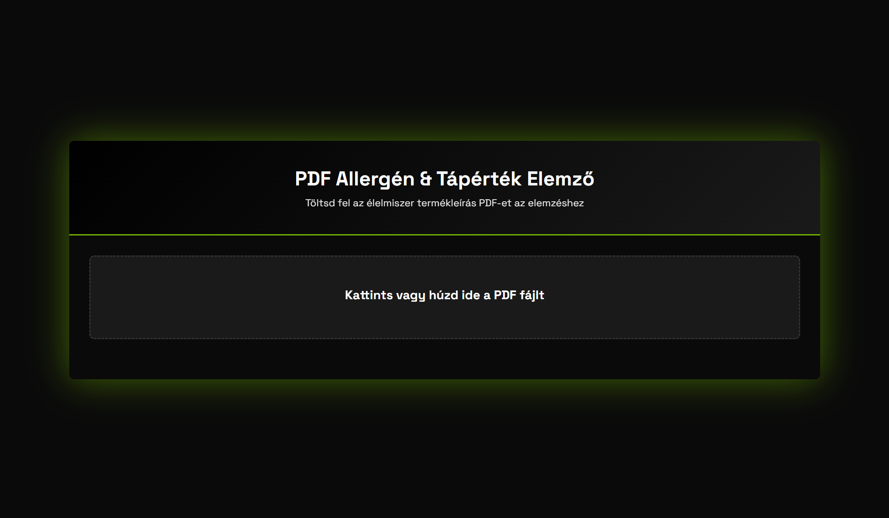

# Felhasználói Kézikönyv

## PDF Allergén & Tápérték Elemző Alkalmazás

Ez az útmutató segít az alkalmazás használatában, lépésről lépésre.

**[Alkalmazás megnyitása böngészőben](https://pdf-analyser-pi.vercel.app)**

---

## Az alkalmazásról:

A **PDF Allergén & Tápérték Elemző** egy webes alkalmazás, amely:
- Élelmiszer termékleírásokat tartalmazó PDF fájlokat dolgoz fel
- Automatikusan felismeri az **allergéneket**
- Kivonja a **tápérték adatokat**
- Mesterséges intelligenciát használ az elemzéshez

---

## Első lépések

### 1. Alkalmazás megnyitása

Nyisd meg a webböngésződben az alkalmazást: **https://pdf-analyser-pi.vercel.app**

### 2. Felület áttekintése

Az alkalmazás egyszerű, felhasználóbarát felülettel rendelkezik:

---

## PDF Feltöltése

### Módszer 1: Kattintás
1. Kattints a feltöltési területre
2. Válaszd ki a PDF fájlt a számítógépeden
3. Kattints a "Megnyitás" gombra

### Módszer 2: Drag & Drop
1. Nyisd meg a mappát, ahol a PDF van
2. Fogd meg a fájlt az egérrel
3. Húzd át a feltöltési területre
4. Engedd el az egérgombot

### Támogatott fájlok
- **Formátum**: Csak PDF (.pdf)
- **Méret**: Maximum 10 MB
- **Típus**: 
  - Normál szöveges PDF
  - Scannelt (képként mentett) PDF
  - Táblázatos adatokat tartalmazó PDF

---

## Elemzés Indítása

1. **Fájl feltöltése után** megjelenik a fájl neve és mérete
2. Kattints az **"Elemzés indítása"** gombra

### Mit csinál az alkalmazás?

1. **PDF feldolgozás**: 
   - Kinyeri a szöveget a PDF-ből
   - Ha szükséges, OCR-t (optikai karakterfelismerést) használ
   
2. **AI elemzés**:
   - Mesterséges intelligencia elemzi a szöveget
   - Azonosítja az allergéneket
   - Kivonja a tápérték adatokat

3. **Eredmény megjelenítés**:
   - Strukturált formában mutatja az adatokat
   - Könnyen olvasható táblázatokban

---

## Eredmények Értelmezése

### Allergének szakasz

- **Tartalmaz** = Az allergén jelen van a termékben
- **Nem tartalmaz** = Az allergén nincs a termékben

### Tápértékek szakasz

**100g-ra vonatkozó értékek:**
Minden tápérték adat 100 gramm termékre van megadva.
**Amennyiben sót tartalmaz az adott termék, úgy kiszámolja mennnyi lehet a nátrium tartalma, tehát lehet nem szerepel az adott PDF-ben szó szerint a nátrium, de ha a só jelen van a termékben, akkor jelzi, hogy tartalmaz nátriumot is, mivel a sónak 40%-a nátrium**

---

## Új Elemzés Indítása

Az eredmények megjelenítése után:
1. Kattints a **"Új elemzés"** gombra
2. Az alkalmazás alaphelyzetbe áll
3. Egy új PDF fájlt tölthetsz fel

---

### Milyen PDF-ek működnek a legjobban?

1. **Termékleírások**:
   - Élelmiszeripari termékek adatlapjai
   - Csomagoláson található információk
   - Online termékleírások PDF-be mentve

2. **Tápérték táblázatok**:
   - 100g-ra vonatkozó értékek
   - Allergén felsorolások
   - Összetevők listája

3. **Nyelv**: 
   - Magyar és angol szövegek
   - Vegyes nyelvű dokumentumok is működnek

---

## Mobil Használat

Az alkalmazás reszponzív, mobilon is használható:

1. **Fájl feltöltés mobilon**:
   - Kattints a feltöltési területre
   - Válaszd ki a fájlt
   - Mobil böngészők is támogatják a drag & drop-ot

2. **Eredmények mobilon**:
   - Optimalizált megjelenítés kis képernyőn
   - Görgethető táblázatok
   - Könnyen olvasható szövegek

---

