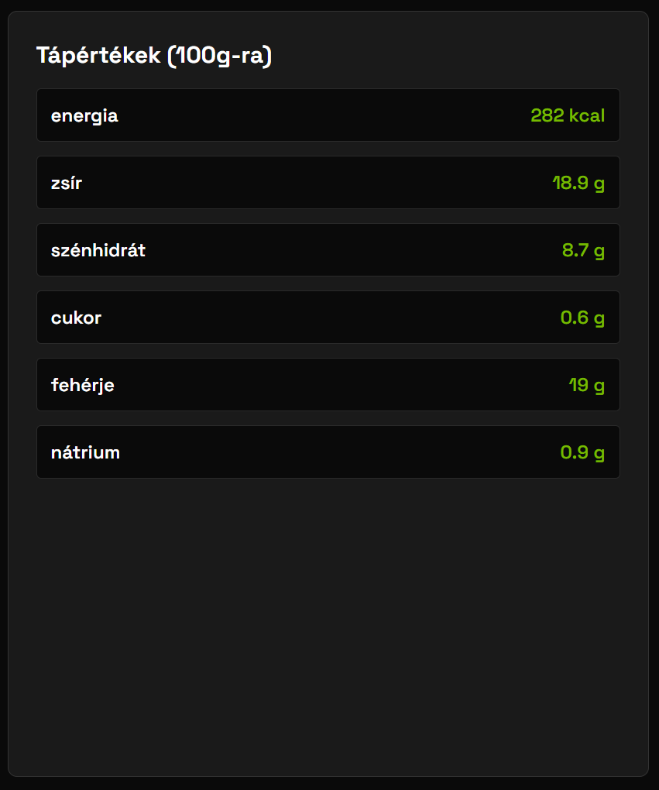
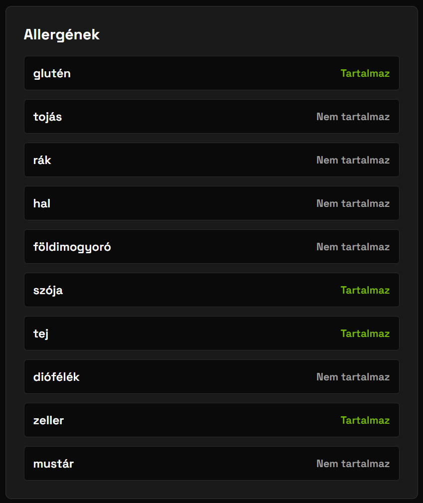
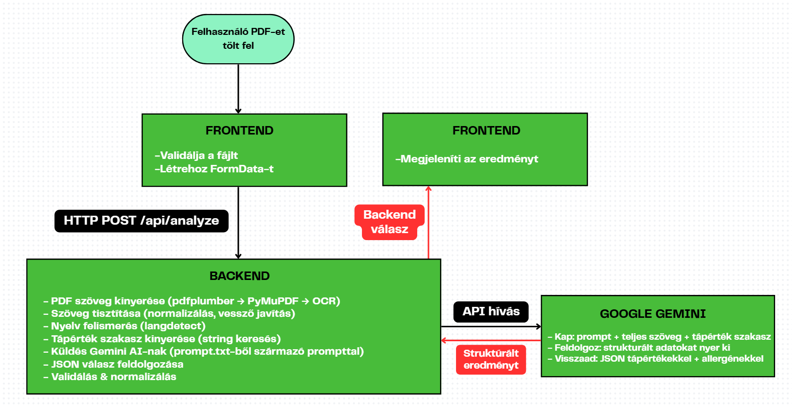
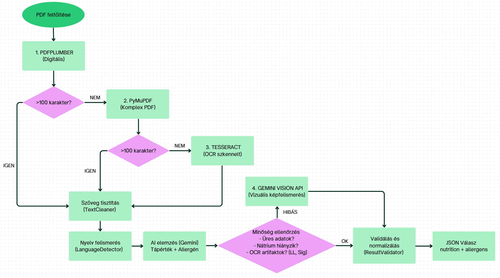
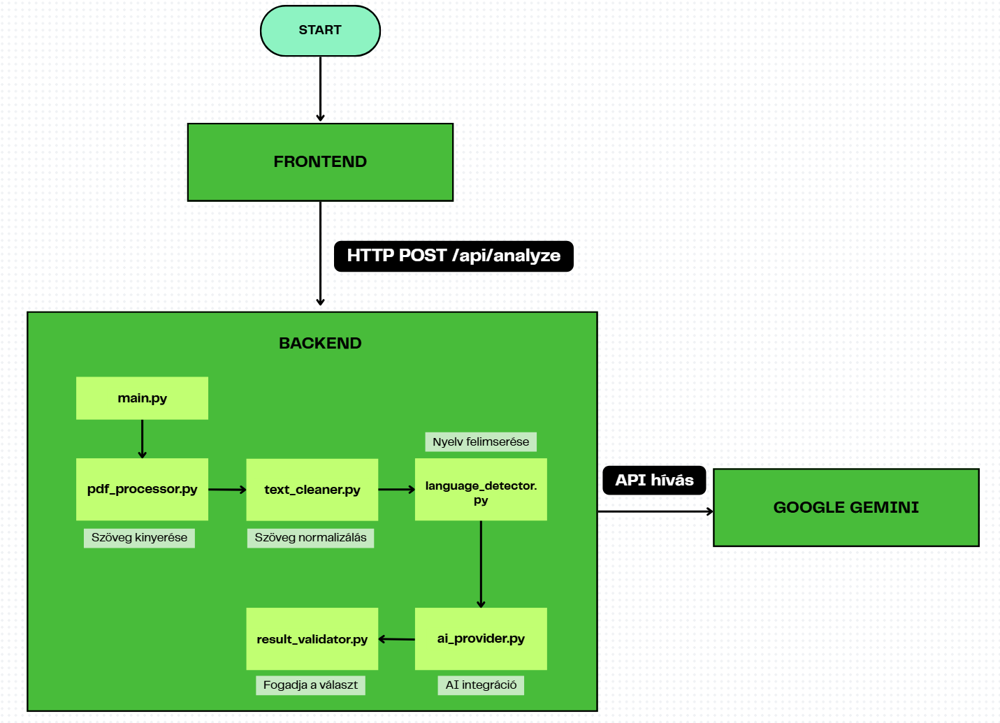
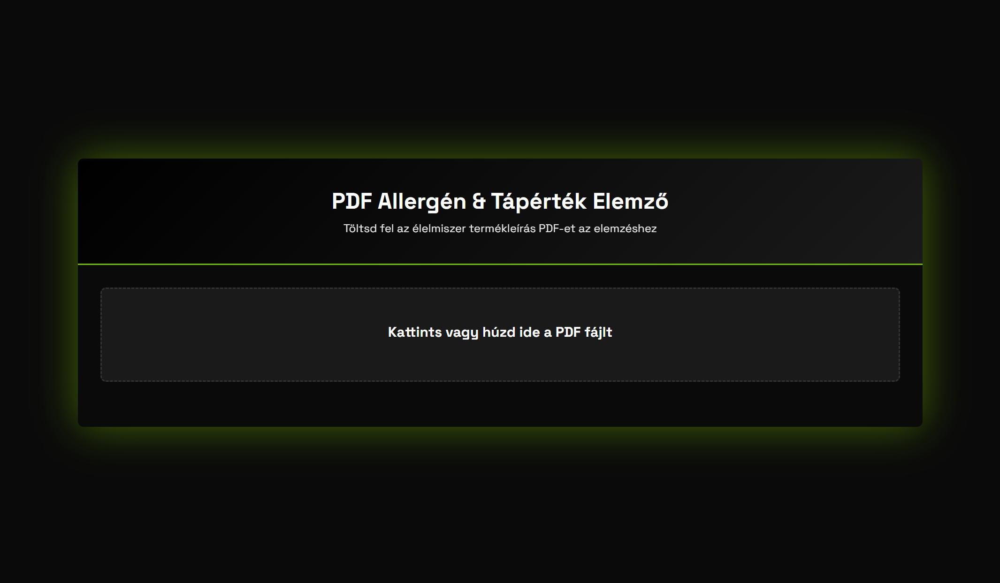
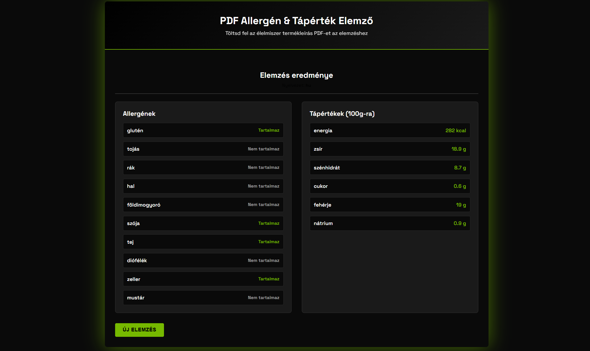

# PDF Tápérték és Allergén Kinyerő

AI-alapú automatizált rendszer tápértékek és allergének kinyerésére PDF dokumentumokból.

## Főbb jellemzők

- 4-lépcsős intelligens PDF feldolgozás (digitális + szkennelt támogatás)
- Google Gemini 2.0 Flash AI integráció
- Automatikus nyelvfelismerés (magyar, angol, német, francia)
- OCR + Vision API hibrid fallback
- Modern React webes felület
- REST API backend (FastAPI)

## Kinyerhető adatok

### Tápértékek (100g-ra)
Energia (kcal), zsír, szénhidrát, cukor, fehérje, nátrium



### Allergének
Glutén, tojás, rák, hal, földimogyoró, szója, tej, diófélék, zeller, mustár



## Architektúra

**Backend:** Python 3.13 + FastAPI + Google Gemini 2.0 Flash

**Frontend:** React 18 + Vite

**PDF feldolgozás:** pdfplumber → PyMuPDF → Tesseract OCR → Gemini Vision API



## PDF Feldolgozási Kaszkád

A rendszer 4-lépcsős fallback mechanizmust használ:

```
1. pdfplumber (digitális PDF)
   → Gyors, natív szövegkinyerés
   
2. PyMuPDF (komplex layout)
   → Ha pdfplumber <100 karakter
   
3. Tesseract OCR (szkennelt)
   → Ha PyMuPDF <100 karakter
   → Poppler + PIL + Tesseract 5.5.0
   
4. Gemini Vision API (hibrid fallback)
   → Ha nátrium hiányzik vagy OCR artifaktok
   → Vizuális AI képfelismerés
```



**Miért hibrid?** 90% PDF-nél ingyenes OCR elég, csak 10% igényel drága Vision API-t (költség optimalizálás)

## Fejlesztői munkafolyamat



*A rendszer belső adatáramlása a PDF beérkezésétől az AI válaszig*

## Használat

### 1. Főoldal - PDF feltöltés



### 2. Új elemzés indítása


### 3. Elemzési eredmények




## Dokumentáció

- [Fejlesztői specifikáció](Docs/Fejlesztoi%20specifikacio.md) - Teljes műszaki dokumentáció
- [Rendszer beállítása](Docs/Rendszer_beallitasa.md) - Telepítési útmutató
- [Felhasználói kézikönyv](Docs/Felhasznaloi_kezikony.md) - Használati útmutató


